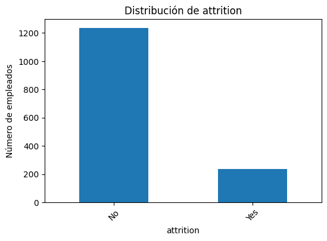
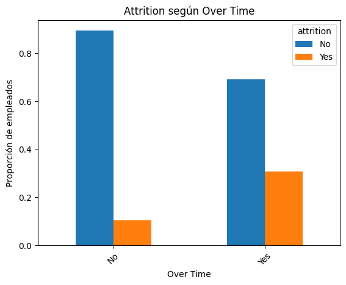
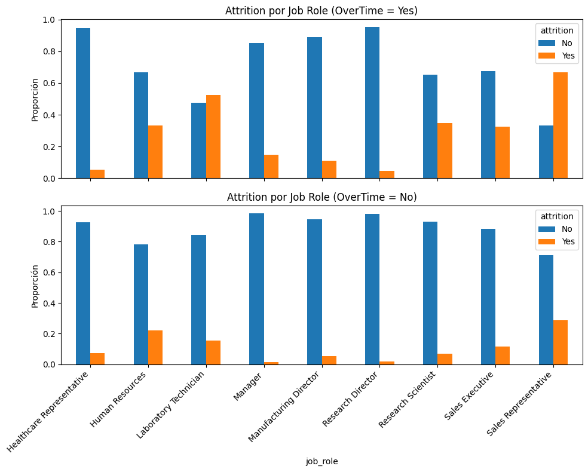
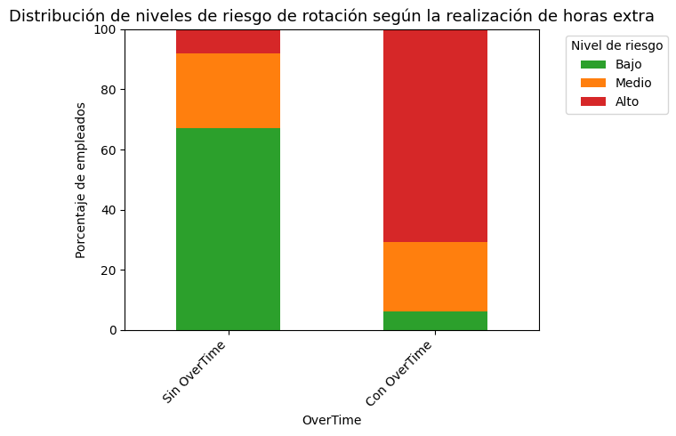

📄 INFORME FINAL
Transformando el Talento: análisis de la satisfacción en el trabajo y retención de empleados para ABC Corporation

1. Introducción

La rotación de empleados (Attrition) es uno de los principales retos en la gestión del talento, ya que implica costes económicos, pérdida de conocimiento interno y un impacto directo en la estabilidad de los equipos.

El objetivo de este proyecto es analizar los factores asociados a la rotación de empleados a partir de un dataset de recursos humanos, con el fin de identificar patrones relevantes y extraer conclusiones que puedan apoyar la toma de decisiones por parte de la empresa.

El proyecto se ha desarrollado de forma colaborativa por un equipo de cuatro personas, abordando el análisis desde distintas perspectivas analíticas y técnicas. Esta aproximación permite enriquecer la comprensión del fenómeno y contrastar los resultados obtenidos desde diferentes enfoques.

2. Dataset y metodología de trabajo

El análisis se basa en un dataset de recursos humanos que recoge información demográfica, laboral y económica de los empleados, incluyendo una variable objetivo que indica si el empleado ha abandonado o no la empresa (Attrition).

El trabajo se ha estructurado en varias fases:

Exploración inicial del dataset

Limpieza y transformación de los datos

Análisis Exploratorio de Datos (EDA)

Análisis específico de la rotación de empleados

Análisis de interacciones entre variables

Desarrollo de un modelo predictivo exploratorio como análisis avanzado

Creación de una base de datos relacional para el almacenamiento del dataset limpio

Esta metodología permite pasar de una comprensión general de los datos a un análisis más profundo y orientado a la toma de decisiones.

3. Limpieza y transformación de datos

Antes de realizar los análisis, se llevó a cabo un proceso de preparación del dataset con el objetivo de garantizar la calidad y coherencia de los datos utilizados.

Las principales acciones realizadas fueron:

Identificación y eliminación de registros duplicados

Análisis y tratamiento de valores nulos

Eliminación de columnas sin valor analítico (identificadores o variables constantes)

Normalización de los nombres de las variables

Transformación de variables categóricas y ordinales

Creación de variables auxiliares para facilitar el análisis posterior

Como resultado de este proceso, se generó un dataset limpio (hr_clean.csv) que se utilizó como base para los análisis finales, las visualizaciones y el modelo predictivo.

4. Análisis Exploratorio de Datos (EDA)

*Figura 1. Distribución de empleados que permanecen frente a aquellos que abandonan la empresa.*

El Análisis Exploratorio de Datos permitió obtener una primera visión general del fenómeno de la rotación y de la distribución de las principales variables del dataset.

En esta fase se analizaron, entre otros aspectos:

La distribución general de la variable Attrition se muestra en la Figura 1.

Variables relacionadas con la satisfacción laboral y el equilibrio entre vida personal y profesional

Variables económicas como el ingreso mensual

Variables relacionadas con la antigüedad y la experiencia laboral

Este análisis inicial permitió identificar variables potencialmente relevantes y sentó las bases para un estudio más detallado de la rotación de empleados.

5. Análisis de Attrition: enfoques complementarios

El análisis específico de la rotación de empleados se abordó desde dos enfoques complementarios, desarrollados por distintas integrantes del equipo. Esta doble aproximación permite contrastar resultados y enriquecer la interpretación de los datos.

5.1 Enfoque descriptivo y comparativo

Desde un enfoque descriptivo, se analizaron las diferencias en la rotación de empleados según distintas variables categóricas, como el género, el nivel educativo, el departamento, el estado civil o el rol desempeñado.

*Figura 2. Proporción de empleados que abandonan la empresa según la realización de horas extra.*

Este análisis permitió identificar patrones generales y observar cómo la proporción de empleados que abandonan la empresa varía entre distintos colectivos, proporcionando una visión global del fenómeno, tal y como se muestra en la Figura 2.

5.2 Enfoque analítico en profundidad

De forma complementaria, se desarrolló un análisis más detallado centrado en variables clave identificadas en el EDA, como la realización de horas extra (OverTime), la satisfacción laboral y el equilibrio entre vida personal y profesional.

Este enfoque incorpora una interpretación orientada a la toma de decisiones, destacando aquellos factores que muestran una relación más clara con la rotación de empleados y que pueden ser relevantes desde una perspectiva de gestión del talento.

Ambos enfoques son coherentes entre sí y refuerzan los principales hallazgos del análisis.

Estos resultados ponen de manifiesto la relevancia de determinadas variables, especialmente la realización de horas extra, lo que justifica analizar con mayor detalle su interacción con otros factores laborales.

6. Análisis de interacciones

*Figura 3. La proporción de rotación aumenta en determinados roles cuando existe realización de horas extra (OverTime).*

Más allá del análisis individual de las variables, se exploraron interacciones entre factores clave para comprender cómo su combinación influye en la rotación de empleados. Esto permite identificar colectivos donde un mismo factor puede tener efectos distintos, apoyando decisiones más segmentadas.

En particular se analizó la interacción entre la realización de horas extra (OverTime) y el rol desempeñado (JobRole). Los resultados muestran que el impacto del OverTime no es homogéneoen determinados roles, se asocia a un incremento notable del riesgo de rotación, actuando como factor amplificador.

Este hallazgo sugiere que las medidas de retención deberían priorizar aquellos perfiles donde la carga horaria tiene mayor impacto.

En consecuencia, se recomienda evitar políticas generalistas sobre horas extra y plantear intervenciones específicas por rol. Esta segmentación permite actuar de forma más eficiente, priorizando colectivos con mayor exposición al riesgo.

7. Modelo predictivo (análisis avanzado)

*Figura 4. Distribución de niveles de riesgo de rotación según la realización de horas extra.*

Como análisis avanzado y complementario, se desarrolló un modelo predictivo exploratorio con el objetivo de estimar la probabilidad de rotación de los empleados y validar los patrones identificados en las fases anteriores del análisis.

El modelo se plantea como una herramienta de apoyo a la toma de decisiones, no como un sistema de predicción individual. Su finalidad es segmentar a los empleados en niveles de riesgo (Bajo, Medio y Alto) y facilitar la priorización de intervenciones preventivas por parte de la organización.

Los resultados del modelo, presentados en la Figura 4, muestran que la realización de horas extra concentra una mayor proporción de empleados clasificados en niveles de riesgo alto de rotación. Este patrón refuerza los hallazgos obtenidos tanto en el análisis exploratorio como en el análisis de interacciones, confirmando el papel del OverTime como un factor clave en la identificación temprana de perfiles con mayor probabilidad de abandono.

8. Interpretación global de resultados

El conjunto de análisis realizados permite extraer varias conclusiones relevantes:

La rotación de empleados es un fenómeno multifactorial

La realización de horas extra destaca como uno de los factores más relevantes, especialmente en determinados roles

Existen colectivos con perfiles de riesgo diferenciados

Variables relacionadas con la satisfacción laboral y el equilibrio personal actúan como factores protectores

El modelo predictivo permite operacionalizar estos resultados y trasladarlos a un contexto de toma de decisiones.

9. Recomendaciones para la empresa

A partir de los análisis realizados, se proponen las siguientes recomendaciones:

A) Priorizar la gestión del OverTime en roles sensibles
Determinados roles muestran un incremento significativo del riesgo de rotación cuando realizan horas extra. Se recomienda revisar la carga horaria y establecer mecanismos de control y compensación específicos para estos colectivos.

B) Diseñar políticas de retención diferenciadas por rol
Dado que el impacto de los factores analizados no es homogéneo, las estrategias de retención deberían adaptarse al contexto de cada puesto.
 
C) Utilizar la segmentación de riesgo como herramienta preventiva
La clasificación de empleados en niveles de riesgo permite identificar perfiles críticos y aplicar acciones preventivas antes de que se produzca la salida del empleado.

D) Complementar el análisis cuantitativo con información cualitativa
En algunos casos, los resultados sugieren la necesidad de profundizar mediante encuestas de clima laboral o entrevistas internas.

E) Establecer un sistema de seguimiento continuo
Integrar este tipo de análisis de forma periódica permitiría evaluar el impacto de las medidas adoptadas y anticipar posibles problemas de rotación.

10. Conclusiones finales

Este proyecto muestra cómo un análisis de datos bien estructurado puede ir más allá de la descripción de resultados y convertirse en una herramienta útil para la toma de decisiones en la gestión del talento.

A través de la combinación de análisis exploratorio, análisis de interacciones y un modelo predictivo exploratorio, se han identificado patrones relevantes que permiten comprender mejor los factores asociados a la satisfacción en el trabajo y a la rotación de empleados y orientar acciones preventivas con mayor criterio.